# Arquitectura del Sistema: Copiloto de Inteligencia Informativa TVN Media

Este documento describe la arquitectura técnica, modelo de datos, flujo de procesamiento y principios de ingeniería implementados en el repositorio para el reto **"De la señal a la decisión: Copiloto de inteligencia informativa y análisis de entorno con IA"** (HackIAthon 4ta Edición).

---

## 1. Visión General y Arquitectura Hexagonal

El sistema sigue estrictamente el patrón de **Arquitectura Hexagonal (Ports & Adapters)** para garantizar que la lógica de negocio (scoring, contratos de evidencia, deduplicación y reglas éticas) sea completamente independiente de frameworks web, motores de almacenamiento o proveedores específicos de modelos de lenguaje (LLM) y modelos de decisión (System One).

```mermaid
graph TD
    subgraph "Entrada / Clientes"
        WebDash["Dashboard Web (ui/index.html - Dark Glassmorphism)"]
        APIClient["Clientes HTTP / cURL / Orquestadores"]
        CLI["Scripts / Runners (run_benchmark.py, periodic_ingestion.py)"]
    end

    subgraph "Adaptadores Primarios (Inbound Adapters)"
        Router["api/routes.py (FastAPI REST API)"]
        StaticUI["main.py (StaticFiles & Dashboard Mounts)"]
    end

    subgraph "Capa de Aplicación y Servicios"
        CopilotSvc["services/copilot_service.py (Priorización, Borradores & Consultas)"]
        Evaluator["services/baseline_evaluator.py (Benchmark 60 Consultas & Baselines)"]
        IngestionSvc["services/ingestion_scheduler.py (Ciclos de Ingesta Periódica)"]
    end

    subgraph "Capa de Dominio (Pure Business Logic)"
        Scoring["domain/scoring.py (P = 30R + 25I + 20U + 15N + 10E)"]
        Safety["domain/safety.py (Anti-Injection & 100% Citas)"]
        Models["domain/models.py (FichaCaso, Noticia, Borrador, Query)"]
    end

    subgraph "Puertos (Interfaces Abstractas)"
        DecisionPort["ports/decision_port.py (BaseDecisionClient)"]
        LLMPort["ports/llm_port.py (BaseLLMClient)"]
        StoragePort["ports/storage_port.py (BaseStorageRepository)"]
    end

    subgraph "Adaptadores Secundarios: Decisión System One"
        Clef["adapters/decision/cloudflare_clef_adapter.py<br>(@cf/cloudflare/clef - Workers AI)"]
        Jev["adapters/decision/jev_adapter.py<br>(TypeSafe Jev)"]
        MockDec["adapters/decision/mock_decision_adapter.py<br>(Offline Determinista / T10)"]
    end

    subgraph "Adaptadores Secundarios: Generación LLM System Two"
        OpenCode["adapters/llm/opencode_adapter.py<br>(Default: muse-spark-1.3-contributor-free)"]
        Gemini["adapters/llm/gemini_adapter.py<br>(gemini-2.5-flash)"]
        MockLLM["adapters/llm/mock_adapter.py<br>(Offline Determinista / T10)"]
    end

    subgraph "Adaptadores Secundarios: Almacenamiento y Datos"
        LocalStorage["adapters/data/loaders.py<br>(CSV / GeoJSON congelados)"]
        SQLiteRepo["adapters/data/sqlite_storage.py<br>(copilot.db WAL - Fichas & Ingesta Viva)"]
        LiveFetchers["adapters/data/live_fetchers.py<br>(RSS, GDELT, Banco Mundial, USGS)"]
        NotionDocs["docs/notion_spec/<br>(8 Páginas Oficiales)"]
    end

    WebDash --> StaticUI
    StaticUI --> Router
    APIClient --> Router
    CLI --> Evaluator
    CLI --> IngestionSvc

    Router --> CopilotSvc
    Router --> Evaluator
    Router --> SQLiteRepo
    CopilotSvc --> SQLiteRepo
    CopilotSvc --> LocalStorage

    IngestionSvc --> LiveFetchers
    IngestionSvc --> SQLiteRepo

    CopilotSvc --> Scoring
    CopilotSvc --> Safety
    CopilotSvc --> Models

    CopilotSvc --> DecisionPort
    CopilotSvc --> LLMPort
    CopilotSvc --> StoragePort
    CopilotSvc --> SQLiteRepo

    Evaluator --> CopilotSvc
    Evaluator --> DecisionPort
    Evaluator --> Scoring

    DecisionPort -.-> Clef
    DecisionPort -.-> Jev
    DecisionPort -.-> MockDec

    LLMPort -.-> OpenCode
    LLMPort -.-> Gemini
    LLMPort -.-> MockLLM

    StoragePort -.-> LocalStorage
    StoragePort -.-> NotionDocs
```



---

## 2. Flujo de Datos de Extremo a Extremo (7 Etapas)

El ciclo de vida de la información sigue el flujo formal estipulado en la Sección 3 del documento del reto, potenciado por la separación de **System One** (decisión rápida no generativa) y **System Two** (redacción editorial reflexiva):

```mermaid
sequenceDiagram
    autonumber
    actor Periodista as Editor/a TVN
    participant Ingesta as 1. Cargar (Loaders)
    participant Agrupador as 2. Organizar (Deduplicador)
    participant Contexto as 3. Contextualizar (WB/USGS)
    participant Decisor as 4. Evaluar (Clef / Jev System One)
    participant MotorScore as 5. Priorizar (Scoring Engine)
    participant Explicador as 6. Explicar (Ficha de Evidencia)
    participant LLM as 7. Producir (OpenCode / Gemini)
    participant Humano as 8. Revisar (Human Review)

    Ingesta->>Agrupador: Usa noticias vivas de hasta 72 h desde SQLite; si faltan, usa snapshot y lo identifica como histórico
    Agrupador->>Contexto: Agrupa titulares similares; no infiere independencia por número de medios
    Contexto->>Decisor: Clasifica tema, estima factores R, I, U, N y detecta contradicciones (T05)
    Decisor->>MotorScore: Retorna probabilidades tipadas y flags fácticos
    MotorScore->>Explicador: Calcula P = 30R + 25I + 20U + 15N + 10E (0-100)
    Explicador->>LLM: Valida estado de evidencia (¿Suficiente para borrador?)
    LLM->>Humano: Genera brief (<=250 pal.), guion (45-60s), copy (<=80 pal.) con citas
    Humano->>Periodista: Aprueba como borrador / Solicita evidencia / Descarta
```

---

## 3. Arquitectura de Dos Niveles de IA: Modelos de Decisión vs Modelos Generativos

### 3.1. System One: Modelos de Decisión Tipados (Cloudflare Clef & TypeSafe Jev)
* **Naturaleza no generativa**: A diferencia de los LLMs tradicionales, no emiten texto en prosa libre ni tokens abiertos. Toman como entrada un estado estructurado (`state`) y un esquema de preguntas tipadas (`noul`, `choice`, `score`), retornando una distribución de probabilidades calibrada para cada opción.
* **Casos de uso en el copiloto**:
  1. **Clasificación temática precisa**: Asignación categórica del eje de la noticia (`economía`, `política`, `canal`, `seguridad`, etc.).
  2. **Estimación probabilística de factores de atención ($R, I, U, N$)**: Medición objetiva de urgencia, novedad, impacto y relevancia.
  3. **Tipificación de afirmaciones**: Clasificación rigurosa entre `hecho`, `declaracion` e `inferencia`.
  4. **Detección de contradicciones fácticas (Prueba T05)**: Comparación de versiones incompatibles entre fuentes independientes sin alucinación.
* **Concurrencia asíncrona controlada**: Orquestación no bloqueante con semáforo configurable (`DECISION_CONCURRENCY_LIMIT`, por defecto 5 peticiones simultáneas) para evitar saturación de tasa de API.
* **Resiliencia Determinista**: Fallback automático y transparente al adaptador `mock` offline en caso de ausencia de credenciales de red (**T10**).

### 3.2. System Two: Modelos Generativos LLM (OpenCode & Google Gemini)
* **Naturaleza generativa estructurada**: Encargados de producir texto editorial coherente bajo estrictos contratos de formato Pydantic.
* **Casos de uso**: Redacción de brief editorial (máximo 250 palabras), copy digital (máximo 80 palabras), guion broadcast para locución (45–60 segundos) y formulación de preguntas de investigación periodística.

---

## 4. Modelo Matemático de Priorización Explicable

El ordenamiento de la bandeja editorial o bancaria no es probabilístico ni opaco, sino una combinación ponderada con trazabilidad completa de sus componentes:

$$P = 30R + 25I + 20U + 15N + 10E$$

| Componente | Peso | Normalización ($0.0 - 1.0$) | Criterio de Medición |
| :--- | :---: | :---: | :--- |
| **$R$ (Relevancia)** | 30 | $[0.0, 1.0]$ | Relación directa con Panamá y temáticas clave (Canal, economía, servicios). |
| **$I$ (Impacto)** | 25 | $[0.0, 1.0]$ | Alcance de interés público o sectorial justificado con datos; sin sensacionalismo. |
| **$U$ (Urgencia)** | 20 | $[0.0, 1.0]$ | Ventana temporal disponible para actuar. Noticias recirculadas reciben penalización. |
| **$N$ (Novedad)** | 15 | $[0.0, 1.0]$ | Diferencia frente a eventos ya agrupados. La duplicación entre agencias no suma novedad. |
| **$E$ (Evidencia)** | 10 | $[0.0, 1.0]$ | Fuentes primarias e identificables con procedencia verificada. |

### Reglas de Desempate y Guardarraíl Crítico
1. **Desempate**: Mayor urgencia ($U$); en caso de persistir, menor ID alfanumérico.
2. **Independencia del Estado de Evidencia**: El estado (`insuficiente`, `parcial`, `suficiente_para_borrador`) es independiente de $P$.
3. **Guardarraíl ético**: *Un puntaje de atención alto con evidencia insuficiente exige investigación; NUNCA habilita la publicación automática de un borrador (T08).*

---

## 5. Conectores Intercambiables

El sistema implementa inyección de dependencias desacoplada mediante variables de entorno:

### Conectores de Decisión (System One)
* **Cloudflare Clef (Default)**:
  * Variable: `DECISION_PROVIDER=cloudflare`
  * Modelo: `CLOUDFLARE_DECISION_MODEL=@cf/cloudflare/clef` (Workers AI)
  * Credenciales: `CLOUDFLARE_ACCOUNT_ID`, `CLOUDFLARE_API_TOKEN`
* **TypeSafe Jev (Alternativo comercial)**:
  * Variable: `DECISION_PROVIDER=jev`
  * Modelo: `TYPESAFE_MODEL=jev-latest`
  * Credenciales: `TYPESAFE_API_KEY`
* **Mock Decision (Offline / Pruebas CI / T10)**:
  * Variable: `DECISION_PROVIDER=mock`
  * Heurísticas deterministas offline sin dependencias de red.

### Conectores Generativos LLM (System Two)
* **OpenCode (Default)**:
  * Variable: `LLM_PROVIDER=opencode`
  * Modelo: `OPENCODE_MODEL=muse-spark-1.3-contributor-free`
  * Base URL: `OPENCODE_BASE_URL=https://api.opencode.ai/v1`
* **Google Gemini (Alternativo)**:
  * Variable: `LLM_PROVIDER=gemini`
  * Modelo: `GEMINI_MODEL=gemini-2.5-flash`
* **Mock LLM (Offline / Pruebas CI / T10)**:
  * Variable: `LLM_PROVIDER=mock`
  * Genera briefs conformes a los contratos de longitud con citas fácticas válidas.

---

## 6. Seguridad, Anti-Inyección y Anti-Alucinación

1. **El texto es dato, nunca instrucción (T07)**: Los contenidos externos se empaquetan dentro de bloques `<source_data id="...">` con sanitización de inyecciones de prompt conocidas.
2. **Abstención Explícita (T06)**: Si el corpus público no contiene evidencia factual para una consulta, el copiloto retorna una abstención explícita documentada; prohibido inventar números o citas.
3. **100% Citas Verificables**: Toda afirmación catalogada como `hecho` o `declaracion` debe vincularse a un `id_fuente` presente en `data/manifest.json`.
4. **Cero Secretos**: Variables de entorno gestionadas vía `.env` local y secretos inyectados en runtime.

---

## 7. Despliegue Automatizado y Operaciones (CI/CD)

El ciclo de integración y despliegue continuo se encuentra completamente automatizado mediante **GitHub Actions**:

* **Integración Continua (`ci.yml`)**: Valida en cada push y PR que el código cumpla con los estándares de calidad (`make check` = ruff lint + ruff format check + mypy + 100% pruebas pytest pasando).
* **Despliegue Continuo (`fly-deploy.yml`)**: Construye la imagen multi-stage (`Dockerfile`) y realiza el despliegue automático hacia producción ante cambios en la rama `main` o ejecución manual.

### Portabilidad de Infraestructura
El despliegue y la entrega continua se orquestan exclusivamente mediante los flujos automatizados de **GitHub Actions**.

---

## 8. Persistencia Transaccional SQLite WAL y Trazabilidad de Casos

Para soportar flujos de trabajo editoriales continuos sin violar la inmutabilidad del corpus congelado (`data/raw/`):
* **Modo WAL (Write-Ahead Logging)**: SQLite opera con concurrencia optimizada en lectura y escritura (`copilot.db` en modo WAL).
* **Esquema `fichas_casos`**: Persiste casos completos con `id_caso`, `titulo_caso`, `score_atencion`, `banda_prioridad`, `estado_evidencia`, `estado_revision`, `persona_revisora`, `observaciones_revision`, `ficha_json`, y marcas temporales UTC.
* **Ciclo Human-in-the-Loop**: Cada acción de revisión (`POST /api/v1/copilot/review`) actualiza la base de datos transaccionalmente, garantizando auditoría completa de decisiones editoriales entre reinicios de contenedor.

---

## 9. Servicio de Benchmark Formal y Evaluación de Baselines

El módulo `services/baseline_evaluator.py` automatiza la verificación científica frente a baselines estándar sobre 60 consultas etiquetadas (`data/benchmark.jsonl`):
* **Baseline de Priorización**: Recencia temporal descendente vs Fórmula de Atención $P = 30R + 25I + 20U + 15N + 10E$ medido en **Precision@5**.
* **Baseline de contradicciones actual**: diez pares sintéticos; regex y regla mock derivada. No llama System One ni mide Macro-F1; requiere reemplazo por evaluación con etiquetas humanas.
* **Métricas de Seguridad**: Cobertura de citas 100% (**T09**), tasa de abstención explícita 100% (**T06**), tasa de defensa anti-inyección 100% (**T07**) y latencia percentil P50/P95.

---

## 10. Dashboard Web Interactivo Dark Glassmorphism

El sistema incluye una interfaz web nativa servida directamente por el backend FastAPI (`src/hackiathon_reto_tvn/ui/`):
* **Arquitectura Liviana**: Cero dependencias npm o herramientas de compilación externas; utiliza HTML5 semántico, Vanilla CSS Dark Glassmorphism y ES6 Javascript reactivo.
* **4 Vistas Principales**:
  1. *Agenda Priorizada (CU-01)*: Ranking visual, barras de desglose de $R, I, U, N, E$, filtros por banda y alerta activa de Guardrail T08.
  2. *Fichas & Borradores (CU-02 a CU-05)*: Navegación de casos, inspección de afirmaciones y citas, previsualización de Brief (250 palabras), Guion TV (45-60s), Copy Digital (80 palabras) y controles de revisión humana.
  3. *Consola Interactiva del Jurado*: Botones para pruebas inmediatas de criterios T04 (BM), T05 (Contradicciones), T06 (Abstención), T07 (Anti-Inyección), USGS, y consola de consulta libre.
  4. *Métricas & Integridad*: KPIs dinámicos, tabla comparativa de baselines y verificador de hashes criptográficos SHA-256.

---

## 11. Espacio de Trabajo Notion Business

El repositorio incluye la especificación íntegra de las 8 páginas obligatorias exigidas por la Sección 5 del reto en [`docs/notion_spec/`](notion_spec/):
* `01-inicio-del-reto.md`: Equipo, roles, problema, usuario objetivo, alcance y accesos.
* `02-plan-y-decisiones.md`: Backlog con 10 tareas, cronograma y 5 decisiones técnicas justificadas.
* `03-catalogo-de-datos.md`: Catálogo exhaustivo de fuentes, licencias y manifiesto SHA-256.
* `04-diseno-de-solucion.md`: Arquitectura, contratos Pydantic, fórmula $P$, prompts y límites.
* `05-casos-y-evidencias.md`: 5 fichas canónicas, citas, borradores y caso de alerta T08.
* `06-pruebas-y-metricas.md`: Matriz T01-T10, benchmark de 60 consultas y comparativa de baselines.
* `07-riesgos-y-etica.md`: Matriz de riesgos, derechos de autor, sesgos y supervisión humana.
* `08-presentacion-al-jurado.md`: Pitch oficial cronometrado de 10 minutos con guión verbal y respuestas clave.
