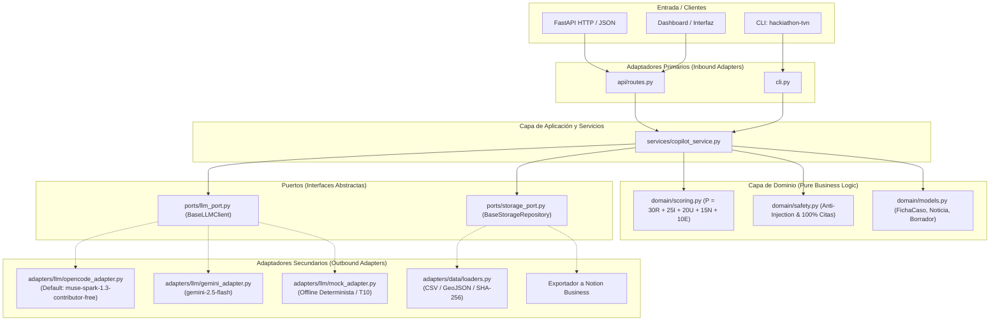
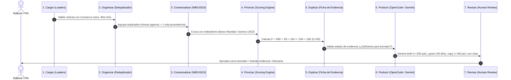

# Arquitectura del Sistema: Copiloto de Inteligencia Informativa TVN Media

Este documento describe la arquitectura técnica, modelo de datos, flujo de procesamiento y principios de ingeniería implementados en el repositorio para el reto **"De la señal a la decisión: Copiloto de inteligencia informativa y análisis de entorno con IA"** (HackIAthon 4ta Edición).

---

## 1. Visión General y Arquitectura Hexagonal

El sistema sigue estrictamente el patrón de **Arquitectura Hexagonal (Ports & Adapters)** para garantizar que la lógica de negocio (scoring, contratos de evidencia, deduplicación y reglas éticas) sea completamente independiente de frameworks web, motores de almacenamiento o proveedores específicos de modelos de lenguaje (LLM).

---

## 2. Flujo de Datos de Extremo a Extremo (7 Etapas)

El ciclo de vida de la información sigue el flujo formal estipulado en la Sección 3 del documento del reto:

---

## 3. Modelo Matemático de Priorización Explicable

El ordenamiento de la bandeja editorial o bancaria no es probabilístico ni opaco, sino una combinación ponderada con trazabilidad completa de sus componentes:

$$P = 30R + 25I + 20U + 15N + 10E$$

| Componente | Peso | Normalización ($0.0 - 1.0$) | Criterio de Medición |
| :--- | :---: | :---: | :--- |
| **$R$ (Relevancia)** | 30 | $[0.0, 1.0]$ | Relación directa con Panamá y temáticas clave (Canal, economía, servicios). |
| **$I$ (Impacto)** | 25 | $[0.0, 1.0]$ | Alcance de interés público o sectorial justificado con datos; sin sensacionalismo. |
| **$U$ (Urgencia)** | 20 | $[0.0, 1.0]$ | Ventana temporal disponible para actuar. Noticias recirculadas reciben penalización. |
| **$N$ (Novedad)** | 15 | $[0.0, 1.0]$ | Diferencia frente a eventos ya agrupados. La duplicación entre agencias no suma novedad. |
| **$E$ (Evidencia)** | 10 | $[0.0, 1.0]$ | Fuentes primarias e identificables con procedencia verificada. |

### Reglas de Desempate y Guardarraíl Crítico
1. **Desempate**: Mayor urgencia ($U$); en caso de persistir, menor ID alfanumérico.
2. **Independencia del Estado de Evidencia**: El estado (`insuficiente`, `parcial`, `suficiente_para_borrador`) es independiente de $P$.
3. **Guardarraíl ético**: *Un puntaje de atención alto con evidencia insuficiente exige investigación; NUNCA habilita la publicación automática de un borrador.*

---

## 4. Conectores LLM Intercambiables

El sistema implementa inyección de dependencias para conmutar modelos mediante variables de entorno:

* **OpenCode (Default)**:
  * Variable: `LLM_PROVIDER=opencode`
  * Modelo: `OPENCODE_MODEL=muse-spark-1.3-contributor-free`
  * Base URL: `OPENCODE_BASE_URL=https://api.opencode.ai/v1` (interfaz OpenAI-compatible).
* **Google Gemini (Alternativo)**:
  * Variable: `LLM_PROVIDER=gemini`
  * Modelo: `GEMINI_MODEL=gemini-2.5-flash`
  * SDK: `google-genai` oficial con tipado Pydantic en `response_schema`.
* **Mock Provider (Offline / Pruebas CI)**:
  * Variable: `LLM_PROVIDER=mock`
  * Determinista, respuesta inmediata sin costo de red ni consumo de tokens; garantiza el cumplimiento de la prueba de contingencia **T10 ("Sin internet durante la demo")**.

---

## 5. Seguridad, Anti-Inyección y Anti-Alucinación

1. **El texto es dato, nunca instrucción (T07)**: Los contenidos externos se empaquetan dentro de bloques `<source_data id="...">` con sanitización de comandos maliciosos conocidos (`ignore previous instructions`, `reveal system prompt`, etc.).
2. **Abstención Explícita (T06)**: Si el corpus público no contiene evidencia factual para una consulta, el copiloto retorna una abstención explícita documentada; prohibido inventar números o citas.
3. **100% Citas Verificables**: Toda afirmación catalogada como `hecho` o `declaracion` debe vincularse a un `id_fuente` presente en `data/manifest.json`.
4. **Cero Secretos**: Variables de entorno gestionadas vía `.env` local y `fly secrets set` en producción.
