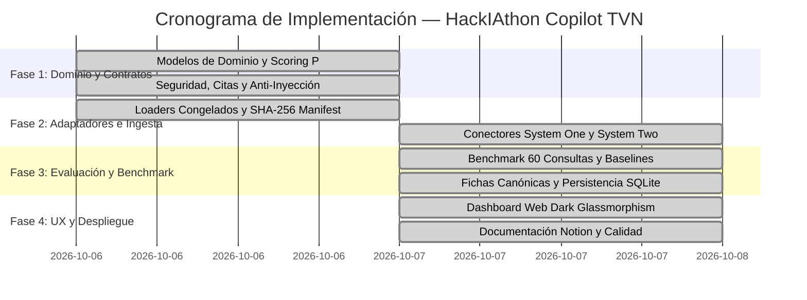

# 02 — Plan y Decisiones de Arquitectura

> **Espacio Oficial de Presentación en Notion Business**  
> **Gestión del Trabajo y Registro de Decisiones de Arquitectura (ADRs)**

---

## 1. Backlog de Trabajo y Trazabilidad de Tareas

A continuación se detalla la matriz de tareas ejecutadas en el repositorio siguiendo el flujo de trabajo ágil con trazabilidad directa a GitHub Issues y Pull Requests:

| ID Tarea | Módulo / Componente | Descripción | Estado | Criterio de Aceptación Verificado |
| :--- | :--- | :--- | :--- | :--- |
| **TSK-01** | `domain/models.py` | Modelado de contratos inmutables: `Noticia`, `Indicador`, `FichaCaso`, `BorradorEditorial`, `BorradorBancario`. | **Completado** | Validación estricta Pydantic v2; campos en `snake_case` (T10). |
| **TSK-02** | `domain/scoring.py` | Implementación de la fórmula $P = 30R + 25I + 20U + 15N + 10E$ y desempate por urgencia. | **Completado** | Bandas no solapadas [0,40), [40,70), [70,100]. Desempate determinista. |
| **TSK-03** | `domain/safety.py` | Sanitización de inyección y control conservador de ID, fragmento citado y términos de afirmación. | **Parcial** | T07; T09 rechaza términos ausentes del fragmento, pero no evalúa implicación semántica ni extrae cada hecho del texto libre. Requiere revisión humana. |
| **TSK-04** | `adapters/data/loaders.py` | Carga de CSV y GeoJSON congelados con tolerancia a nulos y fechas no parseables. | **Completado** | T01 (conserva `None` en fechas/números), T04 (preserva año, país, unidad). |
| **TSK-05** | `adapters/decision/` | Conectores System One: Cloudflare Clef (`@cf/cloudflare/clef`), Jev y Mock offline. | **Implementado; evaluación pendiente** | Los conectores existen; falta medir el proveedor real contra etiquetas humanas. |
| **TSK-06** | `adapters/llm/` | Conectores System Two: OpenCode (`muse-spark-1.3`), Gemini 2.5 Flash y Mock offline. | **Completado** | Generación de paquetes editoriales estructurados con citas estrictas. |
| **TSK-07** | `services/copilot_service.py` | Orquestación: priorización de agenda, detección de contradicciones y abstención explícita. | **Completado** | T05 (contradicciones side-by-side), T06 (abstención explícita sin alucinar). |
| **TSK-08** | `services/baseline_evaluator.py` | Benchmark de 60 consultas (40 desarrollo / 20 reservadas) y comparación con baselines. | **Parcial; requiere revisión** | P@5 exploratorio; evaluación de contradicciones mock. El conjunto reservado no es ciego. |
| **TSK-09** | `adapters/data/sqlite_storage.py` | Capa persistente en SQLite WAL para fichas, revisiones humanas y auditoría de ingesta periódica. | **Completado** | Persistencia transaccional de revisiones editoriales; estadísticas en vivo. |
| **TSK-10** | `ui/ (Dashboard)` | Interfaz web interactiva Dark Glassmorphism para demostración en vivo ante el jurado. | **Completado** | Cero dependencias npm; 4 vistas completas; responsive; compatible offline. |

---

## 2. Cronología y Fases de Ejecución

---

## 3. Decisiones Técnicas Justificadas (Architecture Decision Records — ADRs)

### Decisión 1: Arquitectura Hexagonal Pura (Ports & Adapters) — [ADR-0001]
- **Contexto**: El reto exige independencia total respecto a proveedores comerciales de LLM y capacidad de ejecución determinista sin conexión de red (T10).
- **Decisión**: Aislar el núcleo de negocio en `domain/` con cero dependencias de FastAPI, SQLite, o SDKs de IA. Toda interacción externa se media a través de protocolos abstractos en `ports/`.
- **Justificación**: Permite sustituir proveedores (OpenCode &harr; Gemini &harr; Mock, Clef &harr; Jev) mediante una variable de entorno sin tocar una sola línea de lógica editorial.

### Decisión 2: Segregación entre Modelo de Decisión (System One) y Generativo (System Two) — [ADR-0004]
- **Contexto**: Evaluar los factores $R, I, U, N, E$ y detectar contradicciones (T05) con modelos generativos grandes es lento, costoso y propenso a variaciones estocásticas.
- **Decisión**: Emplear modelos ligeros de clasificación (System One, como Cloudflare Clef o Jev) para scoring y detección booleana, reservando el LLM generativo (System Two, Muse-Spark / Gemini) exclusivamente para redactar el paquete editorial final.
- **Justificación**: Mantener las predicciones del modelo de decisión separadas del LLM generativo. La mejora frente a reglas requiere una evaluación real y etiquetada; aún no está demostrada.

### Decisión 3: Desacoplamiento Estricto entre Corpus Congelado y Persistencia SQLite WAL — [ADR-0010]
- **Contexto**: El reto exige reproducibilidad criptográfica al 100% con un manifest SHA-256 (`data/raw/`), pero la operación productiva en Fly.io requiere almacenar noticias vivas de RSS y estados de revisión humana de las fichas.
- **Decisión**: Mantener `data/raw/` inmutable y montar una base de datos SQLite en modo WAL (`data/storage/copilot.db` o volumen montado en Fly.io `/data`).
- **Justificación**: Garantiza que ninguna prueba ni ejecución en vivo contamine los archivos de referencia del jurado, mientras dota al sistema de persistencia entre reinicios del contenedor.

### Decisión 4: Protocolo de Citación Estricta en Memoria con Abstención Explícita — [ADR-0011]
- **Contexto**: La alucinación de datos estadísticos o citas textuales es inaceptable en una redacción periodística.
- **Decisión**: El motor de respuestas (`answer_query_async`) sólo sintetiza respuestas si localiza fragmentos verificables en el corpus; ante la ausencia de evidencia suficiente emite el marcador canónico `[ABSTENCIÓN EXPLÍCITA]`.
- **Justificación**: Las pruebas locales cubren escenarios controlados. No se presenta una tasa general de citas ni abstención; el benchmark disponible no constituye evaluación humana independiente ni valida sustento semántico.

### Decisión 5: Protección de Rama Principal y Git Rebase Lineal — [ADR-0012]
- **Contexto**: La integración continua en Fly.io despliega automáticamente a producción ante cualquier push a `main`.
- **Decisión**: Prohibir commits directos en `main`; trabajar en ramas `feat/...` y sincronizar siempre mediante `git fetch origin && git rebase origin/main` para preservar un historial lineal sin "merge commits".
- **Justificación**: Evita regresiones accidentales en producción y garantiza trazabilidad atómica para auditoría de código.
